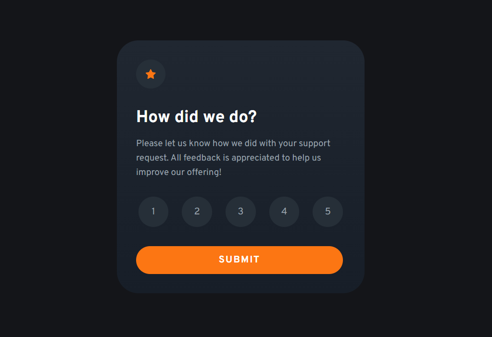
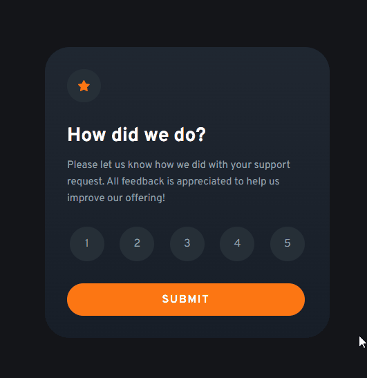
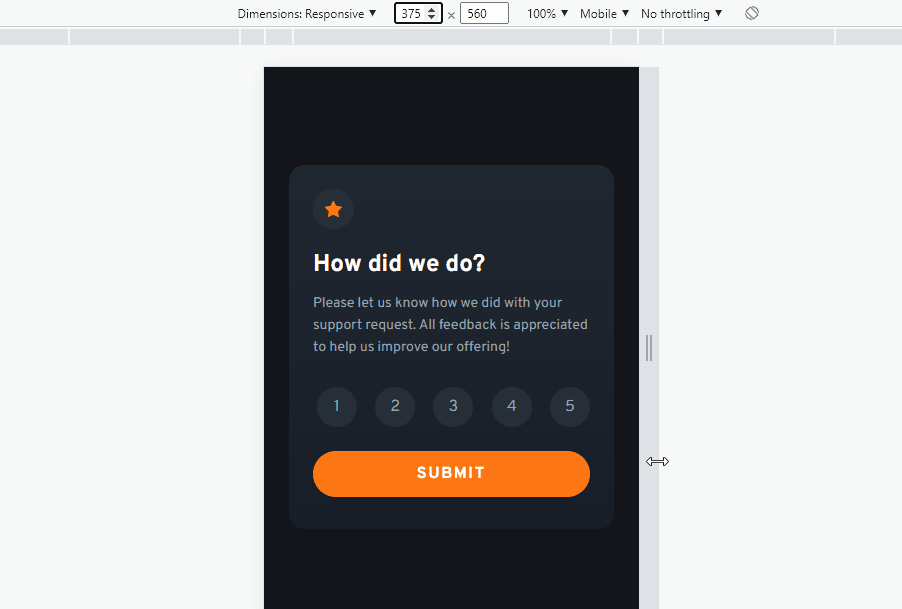

<h1 align="center">Interactive Rating Component</h1>

  

  <h2><a href="https://veraenders.github.io/interactive-rating-component/">Live</a>
   |  
  <a href="https://github.com/VeraEnders/interactive-rating-component">Code</a></h2>
  
This is a solution to the <a href="https://www.frontendmentor.io/challenges/interactive-rating-component-koxpeBUmI">Interactive rating component</a> on FrontendMentor.

 

## About the project 
This challenge is to build out this interactive rating component and get it looking as close to the design as possible. 

Users should be able to:

* Select and submit a number rating
* See the "Thank you" card state after submitting a rating
* See hover and focus states for all interactive elements on the page

## Built with

- Semantic HTML5 markup
- Mobile-first workflow
- [Tailwind CSS](https://tailwindcss.com/) - CSS framework

## Features 

### Rating Submission

Users can select select and submit a number rating. 
After submitting a rating, the component dynamically updates the display to show a "Thank you" card state. It replaces the existing content with a new element created from the provided template. 

  

### Responsive Design

The Rating Component is designed to adapt to different screen sizes and devices.

  

## Author

GitHub - [VeraEnders](https://github.com/VeraEnders)

FrontendMentor - [@veraenders](https://www.frontendmentor.io/profile/veraenders)